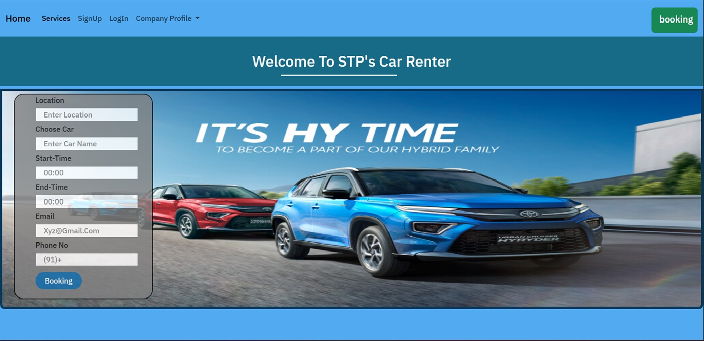
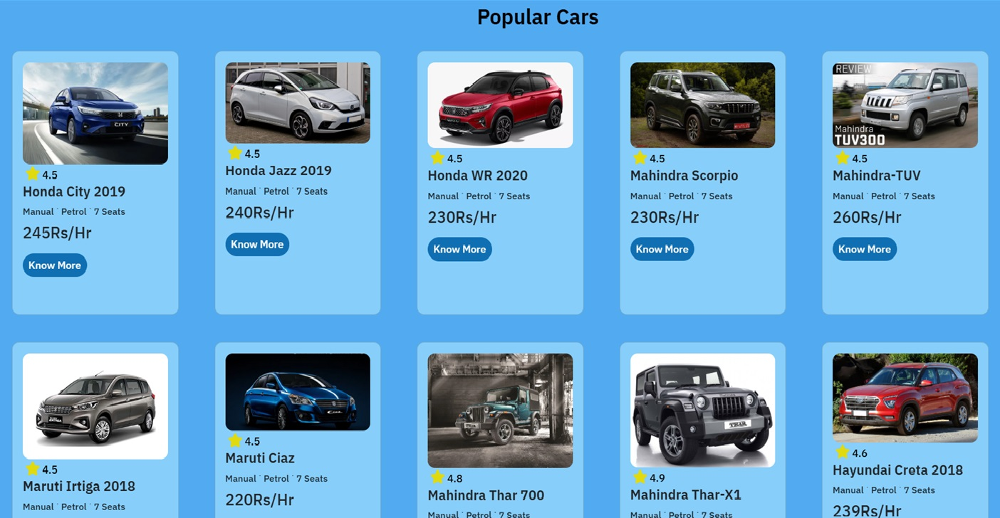

# 🚗 Car Renter  

Car Renter is a **simple and user-friendly car rental system** designed for hassle-free vehicle bookings. Users can browse available cars, check details, and rent them effortlessly.  

## ✨ Features  
✅ Browse and select cars  
✅ Responsive and interactive UI  
✅ Easy booking process  

## 🛠️ Technologies Used  
🔹 HTML, CSS, JavaScript  

## 🖼️ Screenshots

| Home Page | Popular Car Section |
|-------|-----------|
|  |  |

| STP's Car | Gallery Section |
|-------------|------------|
|  |  |

---

## 📌 How to Use  
1️⃣ Clone the repository:  
   git clone https://github.com/Tanu-panwar/Car-Renter.git
    
2️⃣ Live Demo
🔗 [View Live](https://tanu-panwar.github.io/Car-Renter/) 

🚀 Enjoy seamless car renting!  
